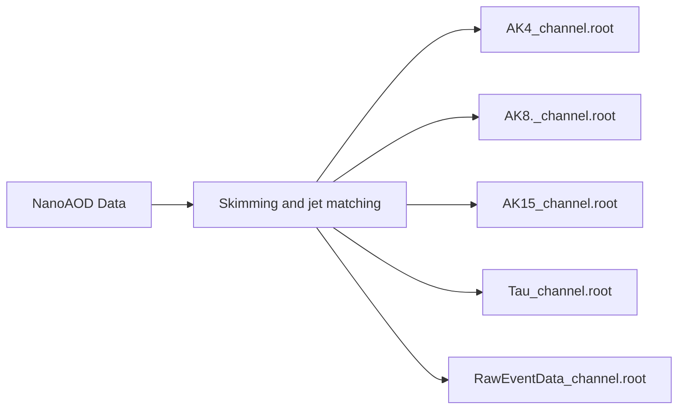

## Data workflow
The purpose of this code is to reproducibly perform jet matching on AK4, AK8 and AK15 jets and their subjets, as well as preselected Tau collection jets. In addition, relevant raw event data is skimmed for analysis and the data is optionally split by decay channel of the taus. 

## How to use
The basic command to run the workflow is
```bash
./run.sh skim --cores "" --config # optional flags
```
The workflow runs in [LCG 109](https://lcginfo.cern.ch/release/109/). In the cores flag indicate how many cores you want to use, and snakemake will automatically paralellize the process. The flags are as follows
<center>

| Flag (set to preset value) | Usage |
|----------|:-------------:|
| data="MADGRAPH, POWHEG" | Specify what data to process. Add paths to own datasets to DATA_DIRS dictionary in the top of Snakefile. | 
| channel="both" | Specify decay channels: "hadhad_only", "inclusive_only" |
| exclude="" | Run process excluding some jet types, e.g. "AK4, Tau" |

</center>
Results will go to jets/ seperated by data name. 

## List of generated parameters
| AK4_channel.root | fatJet_channel.root | AK15_channel.root | Tau_channel.root | RawEventDat.root |
| :--- | :--- | :--- | :--- | :--- |
| `target_mass` | `target_mass` | `target_mass` | `target_mass` | `RawPFMET_pt` |
| `matchedHiggsIdx` | `matchedHiggsIdx` | `matchedHiggsIdx` | `nMatchedGoodTau` | `RawPFMET_phi` |
| `matchedTau1Idx` | `matchedTau1Idx` | `matchedTau1Idx` | `matchedTausIdx` | `PuppiMET_pt` |
| `matchedTau2Idx` | `matchedTau2Idx` | `matchedTau2Idx` | `matchedGenTau1Idx` | `PuppiMET_phi` |
| `nLastCopyTauFromHiggs` | `nLastCopyTauFromHiggs` | `nLastCopyTauFromHiggs` | `matchedGenTau2Idx` | `truthHiggsIdx_raw` |
| `nHiggsTauMu` | `nHiggsTauMu` | `nHiggsTauMu` | `matchedHiggsIdx` | `genH_pt_raw` |
| `nHiggsTauE` | `nHiggsTauE` | `nHiggsTauE` | `is_truth_hadhad` | `genH_eta_raw` |
| `nHiggsTauHad` | `nHiggsTauHad` | `nHiggsTauHad` | `is_truth_ehad` | `genH_phi_raw` |
| `is_truth_ehad` | `is_truth_ehad` | `is_truth_ehad` | `is_truth_muhad` | `dR_tau1_tau2_raw` |
| `is_truth_muhad` | `is_truth_muhad` | `is_truth_muhad` | `genH_pt` | `PV_npvsGood` |
| `is_truth_hadhad` | `is_truth_hadhad` | `is_truth_hadhad` | `genH_eta` | `Pileup_nTrueInt` |
| `genH_pt` | `genH_pt` | `genH_pt` | `genH_phi` | `PV_npvs` |
| `genH_eta` | `genH_eta` | `genH_eta` | `genTau1_pt` | `genTau1_pt_raw` |
| `genH_phi` | `genH_phi` | `genH_phi` | `genTau1_eta` | `genTau2_pt_raw` |
| `PV_npvsGood` | `PV_npvsGood` | `PV_npvsGood` | `genTau1_phi` | `genTau_pt_asym_raw` |
| `Pileup_nTrueInt` | `Pileup_nTrueInt` | `Pileup_nTrueInt` | `genTau2_pt` | `dR_fJ_nolim` |
| `PV_npvs` | `PV_npvs` | `PV_npvs` | `genTau2_eta` | `dR_Jet_nolim` |
| `genTau1_pt` | `genTau1_pt` | `genTau1_pt` | `genTau2_phi` | `dR_AK15_nolim` |
| `genTau2_pt` | `genTau2_pt` | `genTau2_pt` | `genTau_pt_asym` | `is_truth_ehad` |
| `nTauMatchedGoodAK4Jet` | `matchedFatJetIdx` | `matchedAK15JetIdx` | `tau_pt` | `is_truth_muhad` |
| `matchedAK4JetIdx` | `nTauMatchedGoodFatJet` | `nTauMatchedGoodAK15Jet` | `tau_eta` | `is_truth_hadhad` |
| `ak4_pt` | `fj_pt` | `ak15_pt` | `tau_phi` | `DecayProds_absid` |
| `ak4_eta` | `fj_eta` | `ak15_eta` | `tau_mass` | `DecayProds_ptfrac` |
| `ak4_phi` | `fj_phi` | `ak15_phi` | `tau_charge` | `DecayProds_parentTauIdx` |
| `ak4_mass` | `fj_mass` | `ak15_mass` | `tau_dxy` |  |
| `ak4_rawFactor` | `fj_msoftdrop` | `ak15_msoftdrop` | `tau_dz` |  |
| `ak4_mass_rawFactorCorrected` | `fj_rawFactor` | `ak15_rawFactor` | `tau_ipLengthSig` |  |
| `dphi_ak4_pfmet` | `fj_mass_rawFactorCorrected` | `ak15_mass_rawFactorCorrected` | `tau_chargedIso` |  |
| `dphi_ak4_puppimet` | `dphi_fj_pfmet` | `dphi_ak15_pfmet` | `tau_neutralIso` |  |
| `ak4_pt_minus_pfmet_pt` | `dphi_fj_puppimet` | `dphi_ak15_puppimet` | `tau_rawIso` |  |
| `ak4_pt_minus_puppimet_pt` | `fj_pt_minus_pfmet_pt` | `ak15_pt_minus_pfmet_pt` | `tau_rawIsodR03` |  |
| `pfmet_over_ak4_pt` | `fj_pt_minus_puppimet_pt` | `ak15_pt_minus_puppimet_pt` | `tau_puCorr` |  |
| `puppimet_over_ak4_pt` | `pfmet_over_fj_pt` | `pfmet_over_ak15_pt` | `tau_decayMode` |  |
| `dR_ak4_tau1` | `puppimet_over_fj_pt` | `puppimet_over_ak15_pt` | `tau_genPartFlav` |  |
| `dR_ak4_tau2` | `dR_fj_tau1` | `dR_ak15_tau1` | `tau_genPartIdx` |  |
| `dR_ak4_H` | `dR_fj_tau2` | `dR_ak15_tau2` | `tau_idDeepTauVSjet` |  |
| `dR_tau1_tau2` | `dR_fj_H` | `dR_ak15_H` | `tau_idDeepTauVSe` |  |
| `genTau_pt_asym` | `dR_tau1_tau2` | `dR_tau1_tau2` | `tau_idDeepTauVSmu` |  |
| `RawPFMET_pt` | `genTau_pt_asym` | `genTau_pt_asym` | `tau_rawDeepTauVSjet` |  |
| `RawPFMET_phi` | `RawPFMET_pt` | `RawPFMET_pt` | `dR_tau_tau1` |  |
| `PuppiMET_significance` | `RawPFMET_phi` | `RawPFMET_phi` | `dR_tau_tau2` |  |
| `PuppiMET_sumEt` | `PuppiMET_significance` | `PuppiMET_significance` | `dR_tau1_tau2` |  |
| `PuppiMET_sumPtUnclustered` | `PuppiMET_sumEt` | `PuppiMET_sumEt` | `dR_tau_H` |  |
| `PuppiMET_pt` | `PuppiMET_sumPtUnclustered` | `PuppiMET_sumPtUnclustered` | `PV_npvsGood` |  |
| `PuppiMET_phi` | `PuppiMET_pt` | `PuppiMET_pt` | `Pileup_nTrueInt` |  |
|  | `PuppiMET_phi` | `PuppiMET_phi` | `PV_npvs` |  |
|  | `fj_nSubjetsPerEventTotal` | `ak15_nSubjetsPerEventTotal` |  |  |
|  | `fj_nSubjets` | `ak15_nSubjets` |  |  |
|  | `fj_nMatchedSubjets` | `ak15_nMatchedSubjets` |  |  |
|  | `fj_Subjet_mass` | `ak15_Subjet_mass` |  |  |
|  | `fj_Subjet_eta` | `ak15_Subjet_eta` |  |  |
|  | `fj_Subjet_phi` | `ak15_Subjet_phi` |  |  |
|  | `fj_Subjet_pt` | `ak15_Subjet_pt` |  |  |
|  | `fj_Subjet_rawFactor` | `ak15_Subjet_rawFactor` |  |  |
|  | `fj_Subjet_pt_rawFactorCorrected` | `ak15_Subjet_pt_rawFactorCorrected` |  |  |
|  | `fj_Subjet_area` | `ak15_Subjet_area` |  |  |
|  | `fj_Subjet_radius` | `ak15_Subjet_radius` |  |  |
|  | `dR_fj_Subjet_tau1` | `dR_ak15_Subjet_tau1` |  |  |
|  | `dR_fj_Subjet_tau2` | `dR_ak15_Subjet_tau2` |  |  |