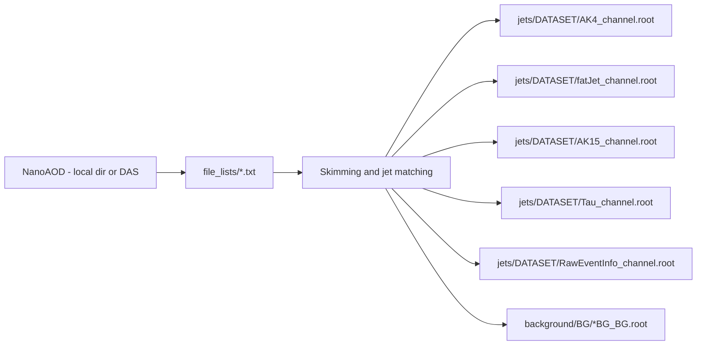

## Data workflow
Skims NanoAOD into small, flat ROOT files per jet type with generator-level Higgs->tautau truth matching. Optionally splits output by decay channel.


```mermaid
flowchart LR
A[NanoAOD - local dir or DAS] --> B[file_lists/*.txt]
B --> C[Skimming and jet matching]
C --> D[jets/DATASET/AK4_channel.root]
C --> E[jets/DATASET/fatJet_channel.root]
C --> F[jets/DATASET/AK15_channel.root]
C --> G[jets/DATASET/Tau_channel.root]
C --> H[jets/DATASET/RawEventInfo_channel.root]
C --> I[background/BG/*BG_BG.root]
```

## Quick start

```bash
./run.sh skim --cores N       # signal skims -> jets/
./run.sh skim_bg --cores N    # background skims -> background/
./run.sh all --cores N
```

Runs in [LCG 109](https://lcginfo.cern.ch/release/109/) Note that `--cores` is a plain Snakemake flag and each skim job uses 6 threads so 12-24 cores lets two-ish datasets skim in parallel.

## Rules

| Rule | Produces |
|---|---|
| `all` | everything below |
| `skim` | signal skims only (`jets/`) |
| `skim_bg` | background skims only (`background/`) |
| `create_file_lists` | `file_lists/<name>.txt` - resolves a dataset/background name to a list of ROOT file paths (local glob or DAS query), see below |
| `skim_run` | runs the compiled skimmer over one dataset's file list |
| `skim_bg_run` | same, for one background's file list |
| `compile` / `compile_bg` | ACLiC-compiles `skimmer/BuildData.C` / `BuildBg.C` |


## Output layout

```
jets/<dataset>/
  RawEventInfo[_hadhad].root
  Jet[_hadhad].root
  fatJet[_hadhad].root
  AK15[_hadhad].root
  Tau[_hadhad].root
background/<bg>/
  TauBG_<bg>.root
  fatJetBG_<bg>.root
  AK15BG_<bg>.root
```

Note that AK4 is legacy (replaced by Tau-object) so it's missing from bg skims. I recommend always running with `--exclude "AK4"`.

## Skim fields

A grouped list of fields produced by the skim. Authored by Claude, email me if there's mistakes.

### RawEventInfo

| Group | Fields |
|---|---|
| Bookkeeping | `NRawEvents`, `event` |
| MET | `RawPFMET_pt`, `RawPFMET_phi`, `PuppiMET_pt`, `PuppiMET_phi` |
| Pileup | `PV_npvsGood`, `Pileup_nPU`, `Pileup_nTrueInt`, `PV_npvs` |
| Truth (unmatched/"raw") | `truthHiggsIdx_raw`, `genH_pt_raw`, `genH_eta_raw`, `genH_phi_raw`, `genTau1_pt_raw`, `genTau2_pt_raw`, `genTau_pt_asym_raw`, `dR_tau1_tau2_raw` |
| Decay channel | `is_truth_ehad`, `is_truth_muhad`, `is_truth_hadhad` |
| Clustering kinematics | `dR_fJ_nolim`, `dR_Jet_nolim`, `dR_AK15_nolim`, `dR_Tau_nolim` (min-max dR(tau,jet) per jet type, no cone-radius cut - this is what `clustering_kinematics` in `plot_workflow` analyses) |
| Decay products | `DecayProds_absid`, `DecayProds_ptfrac`, `DecayProds_parentTauIdx` |

### AK4 / `Jet`

| Group | Fields |
|---|---|
| Bookkeeping | `NRawEvents`, `event` |
| Truth/matching | `target_mass`, `matchedHiggsIdx`, `matchedTau1Idx`, `matchedTau2Idx`, `nLastCopyTauFromHiggs`, `nHiggsTauMu`, `nHiggsTauE`, `nHiggsTauHad`, `is_truth_ehad`, `is_truth_muhad`, `is_truth_hadhad`, `nTauMatchedGoodAK4Jet`, `matchedAK4JetIdx` |
| Generator | `genH_pt`, `genH_eta`, `genH_phi`, `genTau1_pt`, `genTau2_pt`, `genTau_pt_asym` |
| Pileup | `PV_npvsGood`, `Pileup_nTrueInt`, `PV_npvs` |
| Kinematics | `ak4_pt`, `ak4_eta`, `ak4_phi`, `ak4_mass`, `ak4_rawFactor`, `ak4_mass_rawFactorCorrected` |
| MET & dR | `RawPFMET_pt`, `RawPFMET_phi`, `PuppiMET_significance`, `PuppiMET_sumEt`, `PuppiMET_sumPtUnclustered`, `PuppiMET_pt`, `PuppiMET_phi`, `dphi_ak4_pfmet`, `dphi_ak4_puppimet`, `ak4_pt_minus_pfmet_pt`, `ak4_pt_minus_puppimet_pt`, `pfmet_over_ak4_pt`, `puppimet_over_ak4_pt`, `dR_ak4_tau1`, `dR_ak4_tau2`, `dR_ak4_H`, `dR_tau1_tau2` |

### AK8 / `fatJet`

| Group | Fields |
|---|---|
| Bookkeeping | `NRawEvents`, `event` |
| Truth/matching | `target_mass`, `matchedHiggsIdx`, `matchedTau1Idx`, `matchedTau2Idx`, `nLastCopyTauFromHiggs`, `nHiggsTauMu`, `nHiggsTauE`, `nHiggsTauHad`, `is_truth_ehad`, `is_truth_muhad`, `is_truth_hadhad`, `matchedFatJetIdx`, `nTauMatchedGoodFatJet` |
| Generator | `genH_pt`, `genH_eta`, `genH_phi`, `genTau1_pt/eta/phi`, `genTau2_pt/eta/phi`, `genTau_pt_asym` |
| Pileup | `PV_npvsGood`, `Pileup_nTrueInt`, `PV_npvs` |
| Kinematics | `fj_pt`, `fj_eta`, `fj_phi`, `fj_mass`, `fj_msoftdrop`, `fj_rawFactor`, `fj_mass_rawFactorCorrected`, `fj_area` |
| Energy fractions / multiplicity | `fj_chEmEF`, `fj_chHEF`, `fj_hfEmEF`, `fj_hfHEF`, `fj_neEmEF`, `fj_neHEF`, `fj_muEF`, `fj_chMultiplicity`, `fj_neMultiplicity`, `fj_nConstituents` |
| Substructure | `fj_hadronFlavour`, `fj_lsf3`, `fj_tau1`, `fj_tau2`, `fj_tau3`, `fj_tau4` |
| Tagger: GlobalParT3 | `fj_globalParT3_QCD`, `_TopbWev`, `_TopbWmv`, `_TopbWq`, `_TopbWqq`, `_TopbWtauhv`, `_WvsQCD`, `_XWW3q`, `_XWW4q`, `_XWWqqev`, `_XWWqqmv`, `_Xbb`, `_Xcc`, `_Xcs`, `_Xqq`, `_Xtauhtaue`, `_Xtauhtauh`, `_Xtauhtaum`, `_massCorrGeneric`, `_massCorrX2p`, `_withMassTopvsQCD`, `_withMassWvsQCD`, `_withMassZvsQCD` |
| MET & dR | `RawPFMET_pt/phi`, `PuppiMET_significance/sumEt/sumPtUnclustered/pt/phi`, `dphi_fj_pfmet`, `dphi_fj_puppimet`, `fj_pt_minus_pfmet_pt`, `fj_pt_minus_puppimet_pt`, `pfmet_over_fj_pt`, `puppimet_over_fj_pt`, `dR_fj_tau1`, `dR_fj_tau2`, `dR_fj_H`, `dR_tau1_tau2` |
| Subjets: counts | `fj_nSubjetsPerEventTotal`, `fj_nSubjets`, `fj_nMatchedSubjets` |
| Subjets: kinematics | `fj_Subjet_mass/eta/phi/pt`, `fj_Subjet_rawFactor`, `fj_Subjet_pt_rawFactorCorrected`, `fj_Subjet_area` |
| Subjets: substructure/tag | `fj_Subjet_tau1-4`, `fj_Subjet_n2b1`, `fj_Subjet_n3b1`, `fj_Subjet_btagDeepFlavB`, `fj_Subjet_btagUParTAK4B` |
| Subjets: truth | `fj_Subjet_hadronFlavour`, `fj_Subjet_nBHadrons`, `fj_Subjet_nCHadrons` |
| Subjets: UParT regression | `fj_Subjet_UParTAK4RegPtRawCorr[Neutrino]`, `fj_Subjet_UParTAK4RegPtRawRes`, `fj_Subjet_UParTAK4V1RegPtRawCorr[Neutrino]`, `fj_Subjet_UParTAK4V1RegPtRawRes` |
| Subjets: dR | `dR_fj_Subjet_tau1`, `dR_fj_Subjet_tau2` |

### AK15

| Group | Fields |
|---|---|
| Bookkeeping | `NRawEvents`, `event` |
| Truth/matching | `target_mass`, `matchedHiggsIdx`, `matchedTau1Idx`, `matchedTau2Idx`, `nLastCopyTauFromHiggs`, `nHiggsTauMu`, `nHiggsTauE`, `nHiggsTauHad`, `is_truth_ehad`, `is_truth_muhad`, `is_truth_hadhad`, `matchedAK15JetIdx`, `nTauMatchedGoodAK15Jet` |
| Generator | `genH_pt/eta/phi`, `genTau1_pt/eta/phi`, `genTau2_pt/eta/phi`, `genTau_pt_asym` |
| Pileup | `PV_npvsGood`, `Pileup_nTrueInt`, `PV_npvs` |
| Kinematics | `ak15_pt/eta/phi/mass`, `ak15_msoftdrop`, `ak15_rawFactor`, `ak15_mass_rawFactorCorrected`, `ak15_area` |
| Substructure/truth | `ak15_nBHadrons`, `ak15_nCHadrons`, `ak15_tau1/2/3` |
| Tagger: ParTv3 | `ak15_ParTv3_massCorrGeneric`, `_massCorrResonance`, `_massCorrX2p`, `_probQCD`, `_probTopbWev`, `_probTopbWmv`, `_probTopbWq`, `_probTopbWqq`, `_probTopbWtauhv`, `_probXWW3q`, `_probXWW4q`, `_probXWWqqev`, `_probXWWqqmv`, `_probXbb`, `_probXcc`, `_probXcs`, `_probXqq`, `_probXtauhtaue`, `_probXtauhtauh`, `_probXtauhtaum` |
| Tagger: ParticleNetMD | `ak15_ParticleNetMD_mass`, `_probQCDb`, `_probQCDbb`, `_probQCDc`, `_probQCDcc`, `_probQCDothers`, `_probXbb`, `_probXcc`, `_probXqq` |
| MET & dR | `RawPFMET_pt/phi`, `PuppiMET_significance/sumEt/sumPtUnclustered/pt/phi`, `dphi_ak15_pfmet`, `dphi_ak15_puppimet`, `ak15_pt_minus_pfmet_pt`, `ak15_pt_minus_puppimet_pt`, `pfmet_over_ak15_pt`, `puppimet_over_ak15_pt`, `dR_ak15_tau1`, `dR_ak15_tau2`, `dR_ak15_H`, `dR_tau1_tau2` |
| Subjets | `ak15_nSubjetsPerEventTotal`, `ak15_nSubjets`, `ak15_nMatchedSubjets`, `ak15_Subjet_mass/eta/phi/pt`, `ak15_Subjet_rawFactor`, `ak15_Subjet_pt_rawFactorCorrected`, `ak15_Subjet_area`, `ak15_Subjet_nBHadrons`, `ak15_Subjet_nCHadrons`, `dR_ak15_Subjet_tau1`, `dR_ak15_Subjet_tau2` |

### Tau

| Group | Fields |
|---|---|
| Bookkeeping | `NRawEvents`, `event` |
| Truth/matching | `target_mass`, `nMatchedGoodTau`, `matchedTausIdx`, `matchedGenTau1Idx`, `matchedGenTau2Idx`, `matchedHiggsIdx`, `is_truth_hadhad`, `is_truth_ehad`, `is_truth_muhad` |
| Generator | `genH_pt/eta/phi`, `genTau1_pt/eta/phi`, `genTau2_pt/eta/phi`, `genTau_pt_asym` |
| Kinematics | `tau_pt/eta/phi/mass`, `tau_charge`, `tau_dxy`, `tau_dz`, `tau_ipLengthSig` |
| Isolation | `tau_chargedIso`, `tau_neutralIso`, `tau_rawIso`, `tau_rawIsodR03`, `tau_puCorr` |
| Decay mode / truth flavour | `tau_decayMode`, `tau_genPartFlav`, `tau_genPartIdx` |
| Tagger: DeepTau | `tau_idDeepTauVSjet/e/mu`, `tau_rawDeepTauVSjet/e/mu` |
| Tagger: ParticleNet 2023 | `tau_decayModePNet`, `tau_probDM{0,1,2,10,11}PNet`, `tau_ptCorrPNet`, `tau_qConfPNet`, `tau_rawPNetVSe/jet/mu` |
| Tagger: UParT 2024 | `tau_decayModeUParT`, `tau_probDM{0,1,2,10,11}UParT`, `tau_ptCorrUParT`, `tau_qConfUParT`, `tau_rawUParTVSe/jet/mu` |
| dR | `dR_tau_tau1`, `dR_tau_tau2`, `dR_tau1_tau2`, `dR_tau_H` |
| Pileup | `PV_npvsGood`, `Pileup_nTrueInt`, `PV_npvs` |

### Background variants (`BuildBg.C`)

Same fields minus the truth labels.


