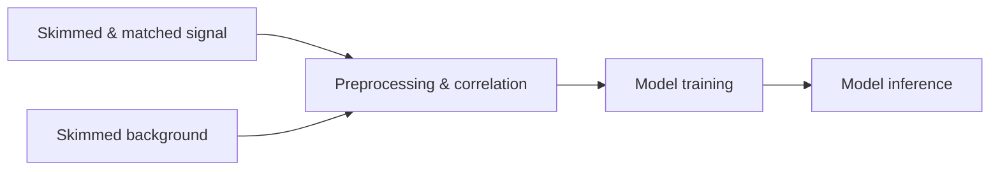

## Training BDT
### Goal
The idea of this code is to provide a workflow for training signal-vs-background tagging for identifying Tau objects and $H\to \tau\tau$ events against $tt$ -background. The Boosted Desicion tree itself is very simple and uses ParticleNet, ParT and DeepTau taggers as inputs. The main purpose is to evaluate the tagging performance of AK4/AK8/AK15 jets and subjets independently of taggers and variable distributions.
### Usage
The workflow consists of the following steps:

which are modular and can be run independently. Like everything else this runs in [LCG 109](https://lcginfo.cern.ch/release/109/). However here paralellization is handeled by XGBoost and snakemake assumes one core (warning: running the pipeline in parallel will result in write/read race conditinons). Run the whole pipeline with
```bash
./run.sh --config #optional flags
```
with optional flags listed here:
| Flag (set to preset value) | Usage |
|----------|:-------------:|
| sig="TauHadHad" | Specify which signal to use. Add own datasets to SIGNAL_DATA_DIRS in the snakefile. | 
| bg="TTto4Q" | Specify which background(s) to use. Add ownn datasets to BG_DATA_DIRS in the snakefile. |
| num_taus=1 | 1 or 2: Train on single jets or matched jet pairs (for AK4 and subjets).  |
|seed=100 |the seed used for train/test splitting of the dataset (for reproducibility) |
|cms_label="Work in Progress"| for the visual representation of the results
|variables = '[]' (all available will be used)| List of params to train on. Note: for now you when ntaus = 2 you have to have this variable for both jets. Fix incoming. 

Only spesific parts of the pipeline can also be run with the self-explatonary rules plot_correlations, train_bdt and bdt_inference (if a previous result is missing it is also run).    