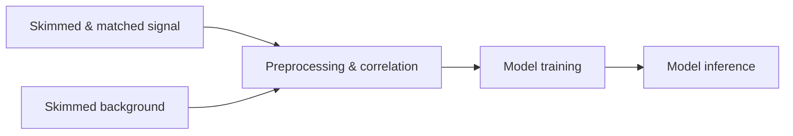

## Training BDT

### Goal

Signal-vs-background tagging for H->tautau events to compare the tagging
performance ofjet types comparably. 
The model is a simple BDT (XGBoost) trained on ParticleNet/ParT/DeepTau
tagger outputs + jet kinematics.


```mermaid
flowchart LR
A[Skimmed & matched signal]
B[Skimmed background]
A-->C[Preprocessing & correlation]
B-->C
C-->D[Model training]
D-->F[Model inference]
```

## Quick start

```bash
./run.sh all --cores N
```


## Rules

| Rule | Produces |
|---|---|
| `plot_correlations` | Feature-correlation heatmaps, signal and background (NOTE: NOT PART OF "ALL") |
| `train_bdt` | one BDT per jet type per background-set |
| `run_bdt_inference` | ROC curve, feature-gain plot, confusion matrix, AUC-vs-pT, saves the inference to pq-file |
| `run_compare_bdts` | AUC-vs-pT and signal-efficiency-vs-pT compared across jet types at a fixed FPRs (intersection) |
| `run_compare_tagging_eff` | Tagging efficiency vs Higgs pT compared across jet types at fixd FPRs (all matched) |
| `run_absolute_evaluation_roc` / `_eff` / `_animation` | ROC/rejection, signal-efficiency-vs-pT, and an animated version, with all events, setting unmatched as 0 score |
| `run_visualize_models` | Renders some sample trees from models |


### Naming note

`sigs`/`compare_names` use the *base* names (`Tau`, `fatJet`, `AK15`), which
map internally to (`Tau`, `AK8`, `AK15`).

## Output layout

```
results/<variables>/<training_channel>/<sig_generator>/<bg_set>/<subjets>/
  bdt_<r_id>.json
  roc_<r_id>.png, feat_<r_id>.png, conf_<r_id>.png, auc_pt_single_<r_id>.png
  inference_results_<r_id>.parquet
  auc_pt_compare_<cmp_id>_FPR<fpr>.png, sigeff_pt_compare_<cmp_id>_FPR<fpr>.png
  tagging_eff_compare_<cmp_id>_FPR<fpr>_{matched,absolute}.png
  abs_eval_{roc,rej}_<cmp_id>.png, abs_eval_sigeff_pt_<cmp_id>_FPR<fpr>.png
```


